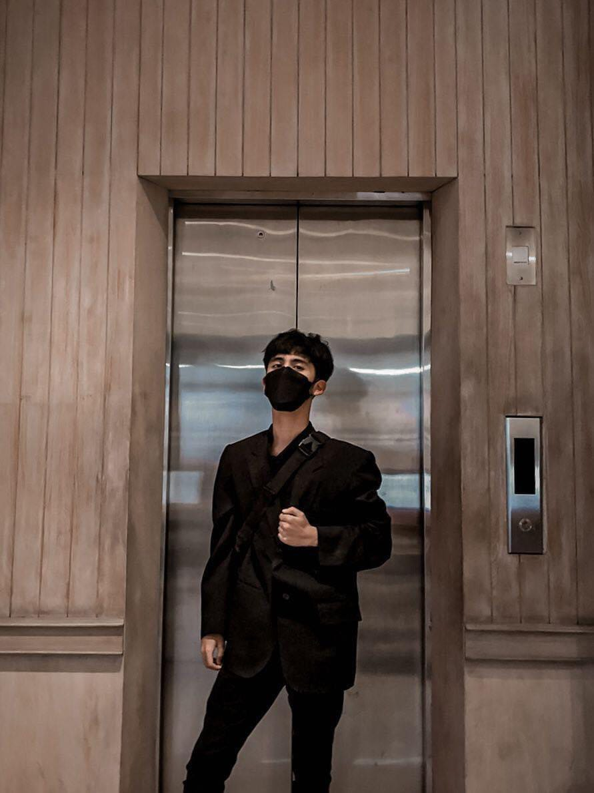
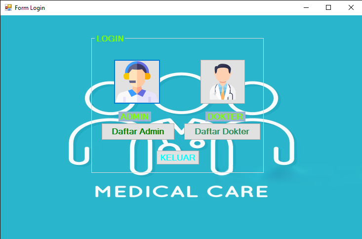
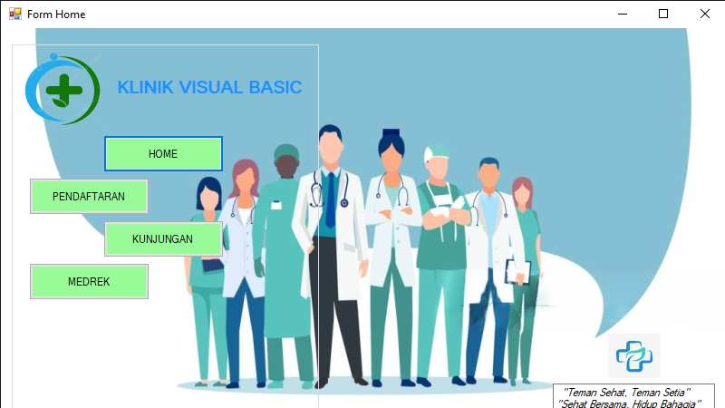
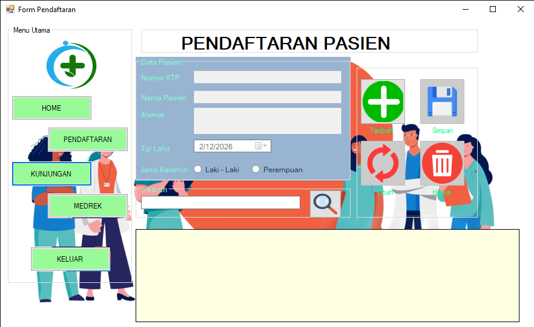

# 📁 STRUKTUR FILE UNTUK GITHUB PAGES

Panduan lengkap struktur file portfolio Afriza untuk deploy ke GitHub Pages.

---

## ✅ STRUKTUR FOLDER LENGKAP

```
AfrizaFastaqimummalka.github.io/
│
├── index.html                  ✅ File utama (CONVERTED dari PHP)
│
├── assets/
│   ├── css/
│   │   └── style.css          ✅ File CSS (TIDAK BERUBAH)
│   │
│   ├── js/
│   │   └── script.js          ✅ File JavaScript (TIDAK BERUBAH)
│   │
│   ├── images/
│   │   ├── profile.jpg        ⬅️ UPLOAD FOTO PROFIL ANDA
│   │   ├── favicon.png        ⬅️ UPLOAD FAVICON (optional)
│   │   │
│   │   ├── kliniklogin.png    ⬅️ Project 1 screenshots
│   │   ├── klinikhome.png
│   │   ├── klinikdaf.png
│   │   │
│   │   ├── apoteklogin.png    ⬅️ Project 2 screenshots
│   │   ├── apotekloginn.png
│   │   ├── apotekhome.png
│   │   │
│   │   ├── storehom.png       ⬅️ Project 3 screenshots
│   │   ├── storeproduc.png
│   │   ├── storece.png
│   │   │
│   │   ├── web1.png           ⬅️ Project 4 screenshots
│   │   ├── web2.png
│   │   └── web3.png
│   │
│   └── cv.pdf                 ⬅️ UPLOAD CV ANDA (PDF)
│
├── data/                      
│   └── projects.json          ℹ️  File JSON (tidak dipakai di HTML, tapi simpan untuk referensi)
│
├── README.md                  ℹ️  Dokumentasi (optional)
└── .gitignore                 ℹ️  Git ignore file (optional)
```

---

## 📝 PENJELASAN FILE

### 1. index.html
- **Apa ini?** Halaman utama website
- **Status:** ✅ Sudah saya convert dari PHP
- **Perubahan:** Data dari PHP sudah hard-coded ke HTML
- **Action:** Tidak perlu edit, LANGSUNG PAKAI

### 2. assets/css/style.css
- **Apa ini?** File styling (desain website)
- **Status:** ✅ TIDAK BERUBAH dari file asli Anda
- **Action:** Tidak perlu edit

### 3. assets/js/script.js
- **Apa ini?** File JavaScript (slider, navigation, animations)
- **Status:** ✅ TIDAK BERUBAH dari file asli Anda
- **Action:** Tidak perlu edit

### 4. data/projects.json
- **Apa ini?** File data projects (di PHP ini dibaca, di HTML sudah langsung di hard-code)
- **Status:** ℹ️  Tidak dipakai di versi HTML
- **Action:** Simpan untuk referensi saja (kalau mau update data nanti)

### 5. assets/cv.pdf
- **Apa ini?** File CV Anda
- **Status:** ⚠️  BELUM ADA - HARUS UPLOAD!
- **Action:** Upload CV Anda (PDF format)

### 6. assets/images/ (folder screenshots)
- **Apa ini?** Semua gambar project + foto profil
- **Status:** ⚠️  BELUM ADA - HARUS UPLOAD!
- **Action:** Upload 13 file gambar (1 profile + 12 screenshots)

---

## 📸 CARA UPLOAD CV & GAMBAR

### **METODE 1: Via Git (Command Line)**

```bash
# 1. Masuk ke folder portfolio
cd /path/to/portfolio

# 2. Buat folder images jika belum ada
mkdir -p assets/images

# 3. Copy/move file CV ke folder assets
# Windows:
copy C:\Downloads\cv.pdf assets\cv.pdf
# macOS/Linux:
cp ~/Downloads/cv.pdf assets/cv.pdf

# 4. Copy/move semua gambar ke folder assets/images
# Windows:
copy C:\Downloads\profile.jpg assets\images\
copy C:\Downloads\kliniklogin.png assets\images\
# ... dst untuk semua 13 gambar

# macOS/Linux:
cp ~/Downloads/profile.jpg assets/images/
cp ~/Downloads/kliniklogin.png assets/images/
# ... dst untuk semua 13 gambar

# 5. Add ke Git
git add assets/cv.pdf assets/images/*

# 6. Commit
git commit -m "Add CV and project screenshots"

# 7. Push ke GitHub
git push
```

### **METODE 2: Via GitHub Web Interface (Lebih Mudah!)**

**Step 1: Upload CV**
1. Buka repository di browser: `https://github.com/AfrizaFastaqimummalka/AfrizaFastaqimummalka.github.io`
2. Navigate ke folder `assets`
3. Klik tombol "Add file" → "Upload files"
4. Drag & drop file `cv.pdf`
5. Scroll ke bawah, tulis commit message: "Add CV"
6. Klik "Commit changes"

**Step 2: Upload Foto Profil**
1. Navigate ke folder `assets/images`
2. Klik "Add file" → "Upload files"
3. Drag & drop file `profile.jpg`
4. Commit message: "Add profile photo"
5. Klik "Commit changes"

**Step 3: Upload Screenshots Project 1**
1. Masih di folder `assets/images`
2. Klik "Add file" → "Upload files"
3. Drag & drop:
   - kliniklogin.png
   - klinikhome.png
   - klinikdaf.png
4. Commit message: "Add Clinic Management screenshots"
5. Klik "Commit changes"

**Step 4: Upload Screenshots Project 2**
1. Masih di folder `assets/images`
2. Upload:
   - apoteklogin.png
   - apotekloginn.png
   - apotekhome.png
3. Commit message: "Add Pharmacy Management screenshots"

**Step 5: Upload Screenshots Project 3**
1. Upload:
   - storehom.png
   - storeproduc.png
   - storece.png
2. Commit message: "Add E-Commerce Store screenshots"

**Step 6: Upload Screenshots Project 4**
1. Upload:
   - web1.png
   - web2.png
   - web3.png
2. Commit message: "Add Clinic Web Service screenshots"

**DONE!** Semua file sudah ter-upload!

---

## 🖼️ PERSIAPAN FILE GAMBAR

### **1. Foto Profil (profile.jpg)**

**Requirement:**
- ✅ Format: JPG atau PNG
- ✅ Ukuran: 400x400px (square/persegi)
- ✅ File size: < 200KB
- ✅ Nama file: `profile.jpg` (lowercase, HARUS SAMA!)

**Cara Resize:**
1. Online: https://www.iloveimg.com/resize-image
2. Upload foto → Set 400x400px → Download
3. Atau gunakan Canva/Photoshop

**Tips:**
- Gunakan foto professional
- Background rapi/solid color
- Wajah jelas, lighting bagus
- Dress professional

### **2. Screenshots Projects (12 files)**

**Requirement:**
- ✅ Format: PNG (lebih baik) atau JPG
- ✅ Ukuran: Landscape (horizontal), ideal 1200x675px
- ✅ File size: < 300KB per file
- ✅ Nama file: **HARUS SAMA PERSIS** dengan yang di list!

**List File (HARUS SAMA PERSIS):**
```
Project 1:
- kliniklogin.png
- klinikhome.png
- klinikdaf.png

Project 2:
- apoteklogin.png
- apotekloginn.png
- apotekhome.png

Project 3:
- storehom.png
- storeproduc.png
- storece.png

Project 4:
- web1.png
- web2.png
- web3.png
```

**Cara Ambil Screenshot:**
- Windows: Windows + Shift + S
- macOS: Cmd + Shift + 4
- Atau Snipping Tool

**Cara Compress:**
1. Buka: https://tinypng.com
2. Drag & drop semua screenshots
3. Download hasil compress
4. Pastikan nama file tidak berubah!

### **3. CV (cv.pdf)**

**Requirement:**
- ✅ Format: PDF (HARUS PDF!)
- ✅ File size: < 2MB
- ✅ Nama file: `cv.pdf` (lowercase!)
- ✅ Isi: Professional CV Anda

**Cara Buat CV:**
- Canva: https://www.canva.com/create/resumes/
- Google Docs → File → Download → PDF
- Microsoft Word → Save as PDF

**Isi CV yang Bagus:**
- Contact Info (email, phone, LinkedIn, GitHub)
- Summary/Objective
- Skills (sesuai portfolio)
- Projects (link ke GitHub)
- Education
- Experience (jika ada)

---

## ⚠️ PENTING! NAMA FILE HARUS SAMA PERSIS

**Di index.html, file dipanggil seperti ini:**

```html
<!-- Foto profil -->


<!-- Project 1 screenshots -->




<!-- CV -->
<a href="assets/cv.pdf" download>Download CV</a>
```

**Jika nama file TIDAK SAMA PERSIS:**
- ❌ Gambar tidak muncul (broken image)
- ❌ CV tidak bisa didownload
- ❌ Website error

**Yang Benar:**
- ✅ `kliniklogin.png` (lowercase)
- ✅ `profile.jpg` (lowercase)
- ✅ `cv.pdf` (lowercase)

**Yang Salah:**
- ❌ `KlinikLogin.png` (capital)
- ❌ `Profile.JPG` (capital + extension uppercase)
- ❌ `CV.pdf` (capital)
- ❌ `klinik login.png` (ada spasi)

---

## 📋 CHECKLIST UPLOAD FILE

Centang satu per satu saat upload:

### CV:
- [ ] `cv.pdf` uploaded ke `assets/`

### Foto Profil:
- [ ] `profile.jpg` uploaded ke `assets/images/`

### Project 1 - Clinic Management:
- [ ] `kliniklogin.png` uploaded
- [ ] `klinikhome.png` uploaded
- [ ] `klinikdaf.png` uploaded

### Project 2 - Pharmacy Management:
- [ ] `apoteklogin.png` uploaded
- [ ] `apotekloginn.png` uploaded
- [ ] `apotekhome.png` uploaded

### Project 3 - E-Commerce Store:
- [ ] `storehom.png` uploaded
- [ ] `storeproduc.png` uploaded
- [ ] `storece.png` uploaded

### Project 4 - Clinic Web Service:
- [ ] `web1.png` uploaded
- [ ] `web2.png` uploaded
- [ ] `web3.png` uploaded

**Total: 14 files** (1 CV + 1 foto profil + 12 screenshots)

---

## 🧪 CARA TEST SEBELUM DEPLOY

**Test di Local (sebelum push ke GitHub):**

1. Buka File Explorer/Finder
2. Navigate ke folder portfolio
3. Double-click `index.html`
4. Website terbuka di browser
5. **Check:**
   - [ ] Foto profil muncul di About section
   - [ ] Semua 12 screenshots muncul di Projects
   - [ ] Slider berfungsi (geser kiri-kanan)
   - [ ] Button "Download CV" works
   - [ ] Tidak ada broken images (❌)
   - [ ] Responsive di mobile (resize browser)

**Jika Ada Broken Image:**
1. Check nama file → HARUS sama persis (lowercase!)
2. Check path → File ada di folder yang benar?
3. Check extension → JPG/PNG sesuai?

---

## 🚀 AFTER UPLOAD - DEPLOYMENT

Setelah semua file ter-upload ke GitHub:

1. ✅ Wait 1-2 menit untuk GitHub Pages build
2. ✅ Buka: `https://AfrizaFastaqimummalka.github.io`
3. ✅ Check website live
4. ✅ Test semua fitur:
   - Navigation
   - Slider
   - Download CV
   - All images showing
   - Responsive

**Jika ada masalah:**
- Hard refresh browser (Ctrl + Shift + R)
- Check browser console (F12) untuk error
- Tunggu 5 menit, kadang GitHub Pages perlu waktu

---

## 💡 TIPS PRO

### Compress Images:
- SELALU compress sebelum upload!
- Gunakan: https://tinypng.com
- Target: < 200KB per image
- Hasil: Website loading lebih cepat

### Organize Files:
Susun file di komputer Anda dulu sebelum upload:
```
Desktop/
└── portfolio-files/
    ├── cv.pdf
    ├── profile.jpg
    └── screenshots/
        ├── kliniklogin.png
        ├── klinikhome.png
        └── ... (semua screenshots)
```

### Backup:
- Simpan copy semua file di Google Drive
- Jadi kalau ada masalah, bisa re-upload

---

## ❓ FAQ

**Q: Harus upload index.php juga?**
**A:** TIDAK! Index.php TIDAK PERLU. Hanya upload `index.html`.

**Q: File projects.json dipakai tidak?**
**A:** Di HTML statis, tidak dipakai. Tapi simpan untuk referensi.

**Q: Bisa ganti nama file gambar?**
**A:** BISA, tapi harus edit `index.html` juga. Lebih mudah pakai nama yang sudah ada.

**Q: Foto harus JPG atau bisa PNG?**
**A:** Bisa keduanya. JPG lebih kecil size-nya. Tapi nama extension harus sesuai (jpg/png).

**Q: Ukuran max file?**
**A:** GitHub limit 100MB per file. Untuk gambar, ideal < 500KB.

**Q: CV harus PDF atau bisa Word?**
**A:** HARUS PDF. Lebih universal, semua orang bisa buka.

---

**Semangat upload file-nya, Afriza! Tinggal sedikit lagi website live! 🚀**

*Last updated: December 2024*
